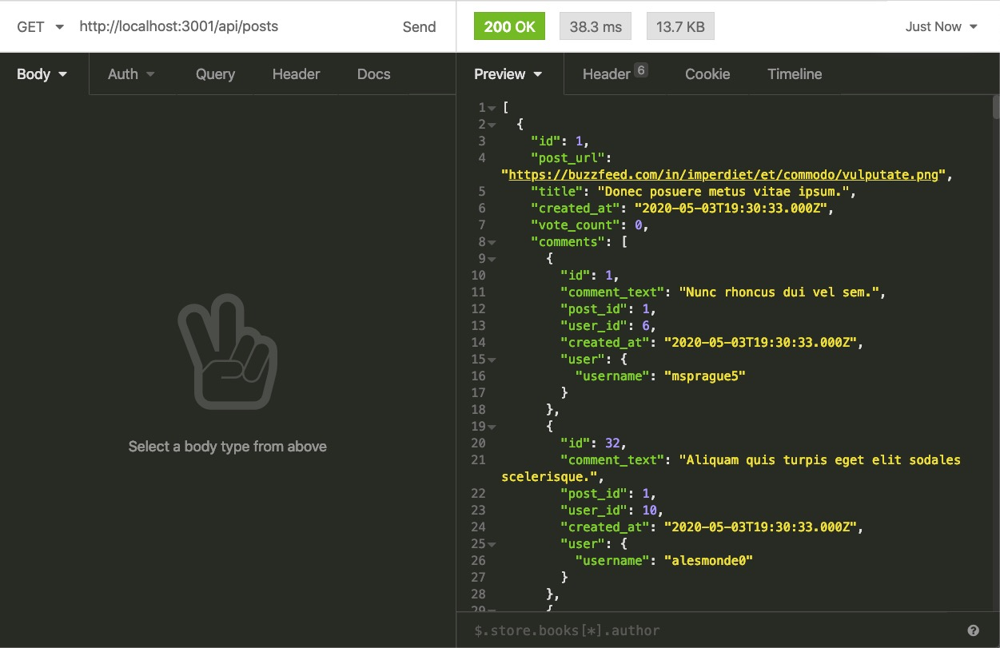
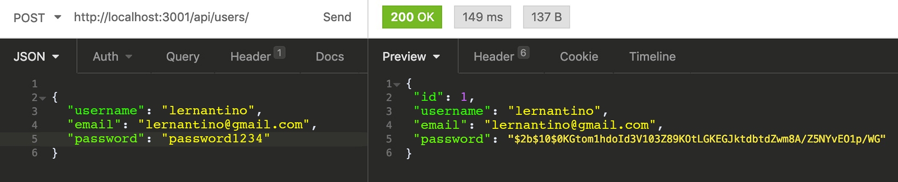
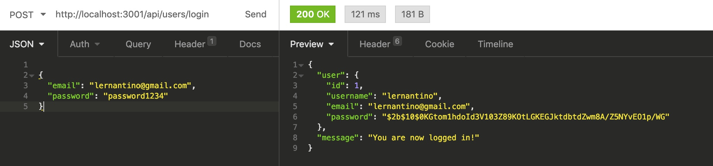
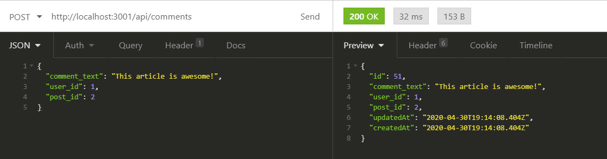

## Object-Relational Mapping (ORM) - Just Tech News

### Description 

*Just Tech News—a tech news website where users can post, upvote, and comment on links to news articles. Use Sequelize, an object-relational mapping (ORM) library, to simplify your MySQL queries, add password hashing so that users can create secure passwords, and connect your application to JawsDB, a MySQL add-on for Heroku*

### Mock-Up

- Use Sequelize with third-party node packages to encrypt user passwords so they're not stored as plaintext in the database

- Create the Login Route for Authentication

- Update the Routes to Include Comments

